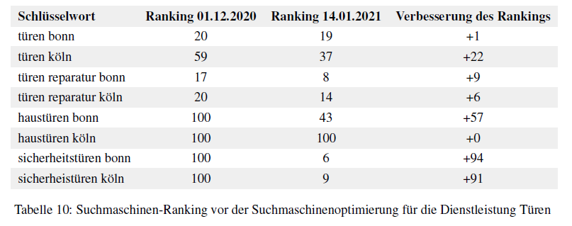

# Erfolgskontrolle

Kapitel 3 der Bachelorarbeit wird mit einer Erfolgskontrolle der umgesetzten SEO-Maßnahmen abgeschlossen. Das Ziel welches dabei verfolgt wird, ist es den abgeleiteten Handlungsleitfaden zu bewerten, indem der Erfolg der angewandten Maßnahmen mit Hilfe von Kennzahlen gemessen wird. Das Messen des Fortschrittes wird wie die SEO-Maßnahmen, als ein zentrales Element im Optimierungsprozess verstanden [1](#1). Dabei werden bestimmte Kennzahlen auch Key Performance-Indikatoren oder kurz KPI erhoben. Für den Content-Erzeuger ist wichtig zu verstehen, das die Erhebung der Kennzahlen den folgenden Zwecken dient:

- **Information**: Eine KPI kann vom Content-Erzeuger als Messwert genutzt werden, um den gegenwärtigen
Stand einer SEO-Maßnahme zu definieren.

- **Kontrolle**: Eine KPI ermöglicht dem Content-Erzeuger zu kontrollieren ob die SEO-Maßnahme Wirkung zeigen.

- **Steuerung**: Eine KPI ermöglicht dem Content-Erzeuger für die angewandten SEO-Maßnahmen Rückschlüsse zu ziehen und daraus zukünftige SEO-Strategien indem neue Handlungsmaßnahmen abgeleitet werden.

Vor Anwendung des Handlungsleitfadens wurde Google Analytics auf den Unternehmenswebseiten integriert. Dabei handelt es sich um kostenloses Tool welches im Stande ist, Auskunft darüber zu geben, wie ein Nutzer sich auf den Webseiten verhält. Dies beinhaltet zum Beispiel Informationen darüber, welche Inhalte der Nutzer sich angeschaut hat und wie lange er auf bestimmten Seiten verweilt ist. Um zusätzliche Daten aus der Google Search Console in Google Analytics nutzen zu können, wurde in der entsprechenden Property-Einstellungen die Search Console-Datenfreigabe aktiviert.

+ [Kennzahl: Suchmaschinen-Rankings](#serankings)
+ [Kennzahl: Traffic](#traffic)
+ [Kennzahl: Impressionen](#impressionen)
+ [Kennzahl: Klicks und Klickrate](#klickrate)
+ [Kennzahl: Ladzeiten](#ladezeiten)

## Kennzahlen
Es folgt eine Beschreibung welche Kennzahlen genutzt wurden, um eine Aussage zum Erfolg oder Misserfolg der umgesetzten Maßnahmen tätigen zu können. Die Kennzahlen werden dabei kurz beschrieben und basierend auf den Berichten aus den Analyse Tools, wird festgehalten wie die Maßnahmen für den betrachteten Zeitraum, sich auf die Unternehmenswebseiten ausgewirkt haben.

### <a name="serankings"><a> Kennzahl: Suchmaschinen-Rankings
Eine Möglichkeit der Erfolgskontrolle ist die Überwachung der Position von einzelnen Schlüsselwörtern für welche die Webseiten ranken. Es handelt sich bei dieser Kennzahl um eine einfache aber sehr wichtige KPI [2](#2). Der Content-Erzeuger kann auf Basis dieser eine Aussage dazu treffen, wie die angewandten SEO-Maßnahmen sich auf die Webseiten, aber auch bestimmte Landingpages ausgewirkt haben. Um die Entwicklung des Rankings innerhalb der Suchmaschine Google, ohne viel Aufwand nachverfolgen zu können, wurde der »Keyword Tracker« von Ubersuggest verwendet. Das Tool zeigt dabei mit unter grafisch an, wie sich die Position für definierte Suchbegriffe sowohl für Mobil- und Desktop Geräte entwickelt hat.

 Abbildung 38: https://app.neilpatel.com/ - Keyword Tracker für BSS Schieh-Schneider
 

Um eine Aussage zum Erfolg oder Misserfolg des definierten SMART-Ziels treffen zu können, folgt zuerst eine Übersicht des Suchmaschinen-Rankings für ausgewählte Suchbegriffe vor Anwendung des Handlungsleitfadens. Das definierte SMART-Ziel aus Kapitel 2.3.2 lautet: 

*»Um das Ranking der Dienstleistungen »Fenster & Türen« bis Mitte Januar 2021 um 20 Prozent zu steigern, möchte ich den entsprechenden Content dank qualitativen und themenspezifischen Schlüsselwörtern verbessern. Dafür ergänze ich bereits vorhandene Inhalte und strukturiere die entsprechenden Bereiche um..«*

Das Suchmaschinen-Ranking in Tabelle 9 stammt vom 01. Dezember 2020. Als Quelle für die Angaben der Suchmaschinen-Rankings wurde die Google Search Console verwendet. Das beste Ergebnis vor Anwendung des Handlungsleitfadens, macht das Schlüsselwort »Fenster Reparatur Bonn« in den Suchergebnissen aus. Bei der Dienstleistung Türen rankte die Unternehmenswebseite mit dem Schlüsselwort »Türen Reparatur Bonn« am besten.

Für Schlüsselwörter welche in Zusammenhang mit den Inhalten »Haustüren«, »Sicherheitstüren«,» Fensterbeschläge« sowie »Sicherheitsbeschläge« stehen, rankten die Unternehmenswebseiten Anfang Dezember nicht in den 100 ersten Suchergebnissen.

Eine Verbesserung des Rankings, konnte ebenfalls für die Schlüsselwörter erreicht werden, welche in Zusammenhang
mit dem Reparaturservice als auch Türen im allgemeinen stehen.

 

Tabelle 10 stellt die Entwicklung des Suchmaschinen-Rankings, für die Dienstleistung Türen vor und nach Anwendung der SEO-Maßnahmen gegenüber. Bis auf »Haustüren Köln« konnte für alle Schlüsselwörter eine Verbesserung des Suchmaschinen-Rankings ermittelt werden. Am 01.12.2020 betrug das durchschnittliche Ranking der Schlüsselwörter für die Dienstleistung Türen 64,5. Nach Anwendung der SEO-Maßnahmen konnte dieses um 35 Plätze, von 64,5 auf 29,5 verbessert werden (Stand 14.01.2021). Die größte Entwicklung verzeichneten dabei die Schlüsselwörter, welche mit den Inhalten der neu erstellten Landingpage »Sicherheitstüren« in Verbindung stehen. Sowohl für den Standort Bonn als auch Köln ist es dem Content-Erzeuger gelungen, die Unternehmenswebseiten für die Schlüsselwörter »Sicherheitstüren Bonn« und »Sicherheitstüren Köln« auf Seite 1 der Suchmaschine Google zu platzieren.

 

Tabelle 11 stellt die Entwicklung des Suchmaschinen-Rankings, für die Dienstleistung Fenster vor und nach Anwendung der SEO-Maßnahmen gegenüber. Bei den Schlüsselwörtern konnte für alle bis auf eins, eine Verbesserung des Suchmaschinen-Rankings erreicht werden. Die beste Entwicklung konnte erneut für ein Schlüsselwort erreicht werden, welches im Zusammenhang mit der Thematik Sicherheit steht. Für die Dienstleistung Fenster handelt es sich dabei konkret um die Schlüsselwörter »Sicherheitsbeschläge Bonn« und »Sicherheitsbeschläge Köln«. Für die Dienstleistung Fenster betrug am 01.12.2020 das durchschnittliche Ranking 63,12. Nach Anwendung der SEO-Maßnahmen konnte der Wert um 48,25 Plätze auf ein durchschnittliches Ranking von 14,87 verbessert werden.

 

Damit konnte das durchschnittliche Suchmaschinen-Ranking für die Schlüsselwörter der Dienstleistung Türen, um 54,26% verbessert werden und für die Dienstleistung Fenster um 76,43%. Das definierte SMART-Ziel das Ranking der Dienstleistungen Fenster und Türen, bis Mitte Januar 2021 um 20 Prozent zu verbessern, konnte vom Content-Erzeuger damit auch erreicht werden. Im Anhang (Anhang 5) befindet sich eine Liste, mit der vollständige Entwicklung der Schlüsselwörter für die Zeit vom 01.12.2020 bis zum 14.01.2021.

### <a name="traffic"><a> Kennzahl: Traffic
Eine weitere Kennzahl für die Erfolgskontrolle ist der »Relativer Zuwachs von Besuchern über Suchmaschinen «. Dieser Key Performance-Indikator stammt aus den Besucherzahlen bzw. dem Traffic einer Webseite. Im Rahmen einer Suchmaschinen-Optimierung steigt nicht nur die Anzahl der Besucher, sondern es verändert sich auch die Herkunft der Besucher [2](#3). Mit der Herkunft der Besucher sind die Kanäle (engl. Channels) gemeint, über welche diese dieWebseiten gefunden haben. Google Analytics hat dazu unterschiedliche Kanäle definiert über welche Nutzer auf eine Webseite gelangen können [4](#4):

- Direkt
- Organsiche Suche
- Verweis
- E-Mail
- Bezahlte Suche
- Andere Werbung
- Display Werbung

Die Kennzahl kann in Google Analytics aus dem Bericht Akquisition > Alle Zugriffe > Channels ermittelt werden. Wie beschrieben wird für den Key Performance-Indikator der Kanal »Orangische Suche« betrachtet.

 Abbildung 39: https://analytics.google.com/ - Relativer Zuwachs von Besuchern über den Kanal Suchmaschinen
 

Laut dem Bericht war der Anteil der Nutzer welche durch den Kanal Organische Suche auf die Unternehmenswebseiten gelangt sind, um 18,52% größer als nach Anwendung der Maßnahmen.

 

### <a name="impressionen"><a> Kennzahl: Impressionen 
In der Google Search Console erhält der Content-Erzeuger unter dem Menüpunkt »Leistung«, Auskunft zu dem Key Performance-Indikator »Impressionen«. Die Impressionen geben an, wie oft die Webseiten oder auch bestimmte Unterseiten in den Suchergebnissen eingeblendet werden. Diese Kennzahl kann als ein »Trendindikator « verstanden werden. Je höher der Wert desto mehr Schlüsselwörter befinden sich in den Inhalten der Webseiten, welche anscheinend auf die Suchanfragen der Nutzer passen. Eine Impression wird gezählt, wenn der Link der Webseite sich in der Suchergebnisseite befindet welche der Suchende betrachtet [5](#5).

 Abbildung 40: https://analytics.google.com/ - Impressionen im Vergleich für alle Fenster Seiten
65
 

Um eine Aussage dazu treffen zu können wie gut oder schlecht die SEO-Maßnahmen, sich für die Dienstleistungen Fenster auf die Impressionen ausgewirkt haben, wurde in Google Analytics ein Bericht für die entsprechenden Webseiten unter dem Menüpunkt Akquisition > Search Console > Landigpages erstellt. Ähnlich wie bei der Traffic KPI »Relativer Zuwachs von Besuchern über Suchmaschinen«, wurde der Zeitraum vom 21.12.2020 bis zum 14.01.2021 mit dem 21.11.2020 bis zum 14.12.2021 betrachtet, da keine Vergleichsdaten aus dem Jahr zuvor vorhanden sind. 
Vor Anwendung der SEO-Maßnahmen wurden die Landingpages der Unternehmenswebseite, welche in Zusammenhang mit der Dienstleistung Fenster stehen 223 Mal in den Suchergebnissen ausgespielt. Nach Anwendung der SEO-Maßnahmen verändert sich dieser Wert auf 1.593 Mal. Dies entspricht einer Steigerung der Impressionen um 614,35%.  
Für die Dienstleistung Türen konnte ebenfalls eine Steigerung der Impressionen verzeichnet werden. Vor Anwendung der SEO-Maßnahmen sind die Landingpages der Unternehmenswebseiten, welche in Zusammenhang mit der Dienstleistung Türen stehen 16 Mal ausgespielt worden. Nach Anwendung der SEO-Maßnahmen verändert sich dieser Wert auf 589 Mal. Diese Veränderung der Impressionen entspricht einer Steigerung von 3.581,25%.

 Abbildung 41: https://analytics.google.com/ - Impressionen im Vergleich für alle Türen Seiten
 

### <a name="klickrate"><a> Kennzahl: Klicks und Klickrate 
Die Kennzahl Klicks gibt an, wie oft ein Nutzer auf ein Suchergebnis geklickt hat um auf die Webseiten zu gelangen, wohingegen die Kennzahl Klickrate (engl. Click-Through-Rate) die Impressionen mit den Klicks vergleicht. Das Ergebnis der Klickrate gibt dem Content-Erzeuger Auskunft darüber, wie viel Suchende auf die ausgespielten URLs im Verhältnis zu den Impressionen geklickt haben.

 

Die Angaben aus Tabelle 13 stammen aus einem Google Analytics Bericht, welcher unter dem selben Menüpunkt
wie der Bericht für die Impressionen erstellt wurde. Die Landingpage Fenster und Türen wurde im Rahmen
der Optimierungsmaßnahmen umstrukturiert, daher existieren für den Zeitraum der betrachtet wird zwei
Einträge. Da bis auf die Landingpage Fenster, alle weiteren Landingpages der Dienstleistungen neu erzeugt
wurden, existieren keine Vergleichswerte zu den Inhalten aus der Zeit davor. Für die Landingpage Fenster kann
eine Verbesserung der Klickrate in Höhe von 1,54% festgestellt werden. Für alle neuen Landingpages konnten
ebenfalls Klicks verzeichnet werden.

 

Ein identisches Ergebnis was die Verbesserung der Klickrate angeht, kann in Tabelle 14 für Landingpages der Dienstleistungen Türen beobachtet werden.

### <a name="ladezeiten"><a> Kennzahl: Ladezeiten

---

<a name="1">1<a> Erlhofer, S. (2014): Suchmaschinen-Optimierung: Das umfassende Handbuch (Galileo
Computing), Seite 67

<a name="2">2<a> Erlhofer, S. (2014): Suchmaschinen-Optimierung: Das umfassende Handbuch (Galileo
Computing), Seite 70

<a name="3">3<a> Erlhofer, S. (2014): Suchmaschinen-Optimierung: Das umfassende Handbuch (Galileo
Computing), Seite 68

<a name="4">4<a> Ryte (o.D.): Channel Grouping <https://de.ryte.com/wiki/ChannelGrouping>

<a name="5">5<a> Google (o.D.): Leistungsbericht (Google Suche) <https://support.google.com/webmasters/answer/7576553>

