# SEO-Strategie
Um der Zielsetzung der Bachelorarbeit gerecht zu werden zu werden, hat das folgende Kapitel das Vorhaben inne, eine SEO-Strategie auszuarbeiten, welche individuell auf das Projekt abgestimmt ist. Ausgangspunkt und Fokus der Strategie ist der Nutzer, deren Webseiten und dessen Bedürfnisse. Der Content-Erzeuger setzt sich dabei mit den Bedürfnissen des Nutzers auseinander und versucht diese mit der Unternehmens Mission abzustimmen [1](#1).

Es gilt dabei nicht nur die Frage zu beantworten was die Bedürfnisse des Nutzers sind, sondern wie diese auf den Webseiten technisch umgesetzt werden können, um den Aufenthalt des Nutzers unterstützend zu begleiten. Qualitative Inhalte spielen eine wichtige Rolle [2](#2), jedoch fließen in die Bewertung einer Webseite seitens der Suchmaschine noch weitere Faktoren mit ein. Aus Sicht des Content-Erzeugers, gilt es daher die Faktoren für die gegenwärtig betrachtenden Webseiten festzustellen und darauf basierend, die entsprechenden Suchmaschinen optimierenden Maßnahmen herzuleiten.

## Die Maslowsche Hierarchie der SEO-Bedürfnisse

 Abbildung 1: https://moz.com/beginners-guide-to-seo - SEO Bedürfnispyramide nach Maslow
 

Die obige Abbildung (Abbildung 1) ist eine Anlehnung an die »Maslowsche Bedürfnispyramide«. Bei dieser handelt es sich um ein sozialpsychologisches Modell, welches auf eine vereinfachende Art und Weise die menschlichen Bedürfnisse und Motivationen, in Form einer hierarchischen Struktur beschreibt [3](#3) [4](#4). Die Theorie besagt, das die Wachstumsbedürfnisse nur zu erreichen sind, wenn nicht sichergestellt wird, dass die grundlegenden Bedürfnisse zu erst erfüllt werden.

Basierend auf der Maslowsche Bedürfnispyramide wurde das Konzept der »Maslowschen Hierarchie der SEO-Bedürfnisse« erstellt [5](#5). Die ersten drei Ebenen stellen die grundlegenden Bedürfnisse dar und bilden dabei aus SEO-Sicht die Maßnahmen ab, welche der Content-Erzeuger besonders aufmerksam betrachten sollte. Den dass Erfüllen der grundlegenden Bedürfnisse hat Einfluss darauf, ob die bereitgestellten Inhalte von den Nutzern überhaupt gefunden werden können. Die weiteren vier Ebenen der Bedürfnispyramide, welche zu den Wachstumsbedürfnisse zuzuordnen sind und repräsentieren Maßnahmen, welche dazu beitragen können die eigenen Inhalte sowohl für die Nutzer, als auch die Suchmaschine hervorstehen zu lassen.

- **Crawl accessibility**: Analog zu den »Physischen Grundbedürfnissen« der Maslowsche Bedürfnispyramide bildet das Fundament der SEO-Maßnahmen die Crawlability. Die Crawlability beschreibt wie die Fähigkeit der Suchmaschine, auf die Inhalte einer Webseite zugreifen können. Eine Webseite ohne Fehler kann vom Suchmaschinen-Crawler vollständig erfasst werden, indem dieser den internen links innerhalb der Webseiten folgt [6](#6). Bevor Inhalte in den Index einer Suchmaschine aufgenommen werden müssen diese zuvor vom Suchmaschinen-Crawler erfasst werden. Crawlability-Probleme könnte zum Beispiel sein, dass eine fehlerhafte Robots.txt erzeugt wurde, welche bestimmte Bereiche der Domain vor dem Crawler der Suchmaschine verbirgt. Das unbeabsichtigte setzen eines »Nofollow-Link« hat ebenfalls zur Folge, dass der Crawler die Seite hinter dem Link komplett ignoriert. Genauso verhält es sich mit einem defekten Link welcher auf eine URL verweist welche nicht existiert. Die publizierten Inhalte auf den unbeabsichtigt ignorierten Seiten oder hinter den defekten Links, würden dadurch nicht in den Suchergebnissen erscheinen.

- **Compelling content**: Qualitative Inhalte welche die Bedürfnisse der Suchenden stillen können, bilden nach der Crawlability die zweite Ebene der SEO Bedürfnispyramide ab. Die Inhalte sollten einzigartig sein, auf einer überschaubaren Strukturierung aufsetzen und dem Suchenden einen gewissen Mehrwert anbieten. Idealerweise werden die Inhalte von keinem Mitbewerber so ansprechend aufbereitet wie die auf den eigenenWebseiten. Die Produkte und Dienstleistungen sind präzise beschrieben. Fragestellungen welche Suchende häufig stellen, werden in den Inhalte beantwortet [7](#7).

- **Keyword optimized**: Auf der dritten Ebene befindet sich die Keyword-Optimierung. In Abhängigkeit der verwendeten Schlüsselwörter, kann mit den publizierten Inhalte einem größeres Publikum erreicht werden. Entscheidende Faktoren bei der Wahl des Schlüsselwortes (eng. Keyword) sind, dass Suchvolumen als auch der Keyword-Schwierigkeitsgrad). Die Kombination aus Schlüsselwörtern mit hohem Suchvolumen, gepaart mit einem niedrigen Keyword- Schwierigkeitsgrad, kann mehr Traffic für die Webseiten generieren [8](#8).

- **Great user experience**: Die vierte Ebene betrachtet die Nutzererlebniserfahrung (User-Experience) einer Webseite. Ein ansprechendes Design der Webseite und eine überschaubare Navigation sind nur einige Einflüsse, welche von Nutzern als positive Nutzererlebniserfahrung interpretiert werden. Für Suchende welche von mobilen Geräten wie einem Smartphone Webseiten aufrufen, spielt die Ladezeit die benötigt wird eine wichtige Rolle. Das Ergebnis einer Google Studie in welcher über 900.000 Landingpage untersucht wurden, hat mitunter ergeben das der Anstieg der Ladzeit von einer auf zehn Sekunden, statistisch gesehen zu einer Absprungrate von 123% führt [9](#9).

- **Share-worthy content**: »Share-worthy content« beschreibt Inhalte welche sich von Blog-Beiträgen und qualitativen Inhalten in der Form unterscheiden, dass der Nutzer diese in seinen Sozialen 10 Netzwerken teilen möchte [10](#10). Dabei könnte es sich zum Beispiel um Inhalte handeln, welche aktuelle Fragen  beantworten oder kontroverse Themen aufgreifen, mit denen sich andere Content-Erzeuger bisher noch nicht beschäftigt haben. Geteilte Inhalte tragen dazu bei, das die Anzahl der eingehenden Links auf die eigenen Webseiten erhöht wird. Dieser Faktor kann wiederum positiv in die Suchmaschinenbewertung mit einfließen  [11](#11).

- **Title, URL & description**: Die fünfte und vorletzte Ebene beschäftigt sich mit Meta-Titelnund Beschreibungen sowie »sprechenden« URLs. Meta-Titel (Seitentitel) geben kurz und prägnant den Inhalt der Seite wieder. Die Meta-Beschreibung hingegen stellt eine kurze Zusammenfassung der Inhalt dar. Der Meta-Titel als auch die Meta-Beschreibungen sind Ranking relevante Faktoren und finden Verwendung in den Suchergebnisseiten [12](#12). Sprechende URLs vermitteln dem Suchenden auch nochmal zusätzlich, worum es sich Inhaltlich auf der entsprechenden Seite handeln wird. Sowohl Meta-Titel, die Meta-Beschreibung als auch die URLs sollten mit Schlüsselwörtern versehen werden. URLs welche mit einem Schlüsselwort versehen wurden, haben statistisch gesehen eine um 45% erhöhte Klickrate im Vergleich zu URLs welche keine Schlüsselwörter verwenden [13](#13).

- **Snippet/Schema markup**: Die letzte Ebene der »Maslowschen Hierarchie der SEO-Bedürfnisse« geht auf das Thema Strukturierte Daten ein. Mit Hilfe von »Markups« können im Quellcode der eigenen Webseite Informationen zu den Inhalten strukturiert werden. Suchmaschinen profitieren von den aufbereiteten Markups da diese ihnen ermöglichen, die bereitgestellten Inhalte mit weniger Aufwand zu erkennen, bearbeiten und intern zu organisieren [14](#14). Je detaillierter die Angaben desto größer die Wahrscheinlichkeit, dass die Suchmaschine die Inhalte auch der Zielgruppe anzeigt, welche der Content-Erzeuger zu erreichen versucht.

Damit das Ziel die Sichtbarkeit der Unternehmenswebseiten für das Thema »Fenster & Türen« zu verbessern erreicht werden kann, wird die folgende SEO-Strategie sich danach ausrichten, die Anforderungen der einzelnen Ebenen der »SEO-Bedürfnispyramide« zu erfüllen.

## Crawlability prüfen

Die Prüfung ob eineWebseite durch den Suchmaschinen Crawler in den Index aufgenommen werden konnte, lässt sich für Google mit folgenden Suchoperator nachvollziehen:

`site:bss-schieh-schneider.de`

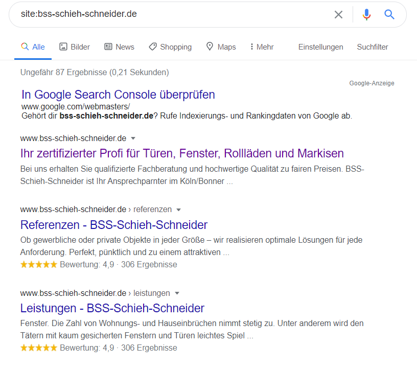 Abbildung 2: Quelle: www.google.com - Erweiterer Suchoperator
 

Das Ergebnis der erweiterten Suche gibt zurück, dass die Suchmaschine Google für die Domain www.bss-schieh-schneider.de ungefähr 87 Seiten in ihrem Index hat. Bei dem Wert handelt es sich lediglich um eine Annäherung des tatsächlichen Ergebnisses. Möchte zum Beispiel gezielt geprüft werden ob der Bereich »Leistungen« sich im Index der Suchmaschine Google befinden, wird der Suchoperator um den entsprechenden Verzeichnis Namen erweitert.

`site:bss-schieh-schneider.de/leistungen`

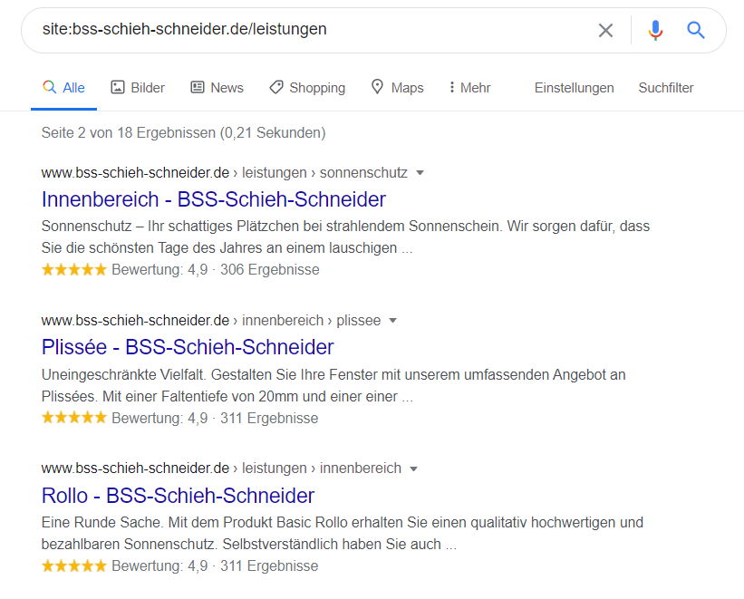 Abbildung 2: Quelle: www.google.com - Erweiterer Suchoperator Leistungen
 

Der erweiterte Suchoperator gibt als Ergebnis 18 Seiten zurück, was übereinstimmt mit der Anzahl der Seiten welche sich im Verzeichnis der Leistungen befinden. Sollten Seiten fehlen kann dies mehrere Gründe haben. Neue Inhalte zum Beispiel müssen erst einmal vom Crawler der Suchmaschine erfasst werden, bevor diese im Index angeboten werden können.

Eine Webseite sollte hinsichtlich ihrer Crawlability geprüft werden, denn eventuell können die Unterseiten einer Webseite von Suchmaschinen Crawler gar nicht erfasst werden. Die Suchmaschine differenziert bei Crawlability hinsichtlich den zwei Fehlertypen **Site errors** und **URL errors** [15](#15). »Site errors« sind Fehler, die nicht für eine spezifische URL der Webseiten gelten, sondern die gesamte Webseite betreffen. Darunter fallen Probleme beim auflösen des Domainnamens, Verbindungsprobleme mit dem Webserver, oder wenn die »robots.txt« der Webseiten nicht abgerufen werden kann. »URL errors« sind Fehler welche sich auf eine spezifische URL derWebseite beziehen. Die Webseiten URLs konnten in dem Fall vom Suchmaschinen Crawler aufgerufen, der Domainname aufgelöst und die »robots.txt« abgerufen werden, allerdings hat danach etwas nicht funktioniert. Beide Fehlertypen sollten umgehend behoben werden, dabei sind »Site errors« als kritisch zu betrachten da diese die vollständige Webseite betreffen.

Eine bequemere Methode die Seiten hinsichtlich ihrer Crawlability zu prüfen, bietet das kostenlose SEO Site Audit Tool (https://ahrefs.com/site-audit) von Ahref.

Die Auswertung des Tests für die Unternehmenswebseiten konnte hinsichtlich der Crawlability 61
Fehler vom Typ »Site errors« identifizieren.

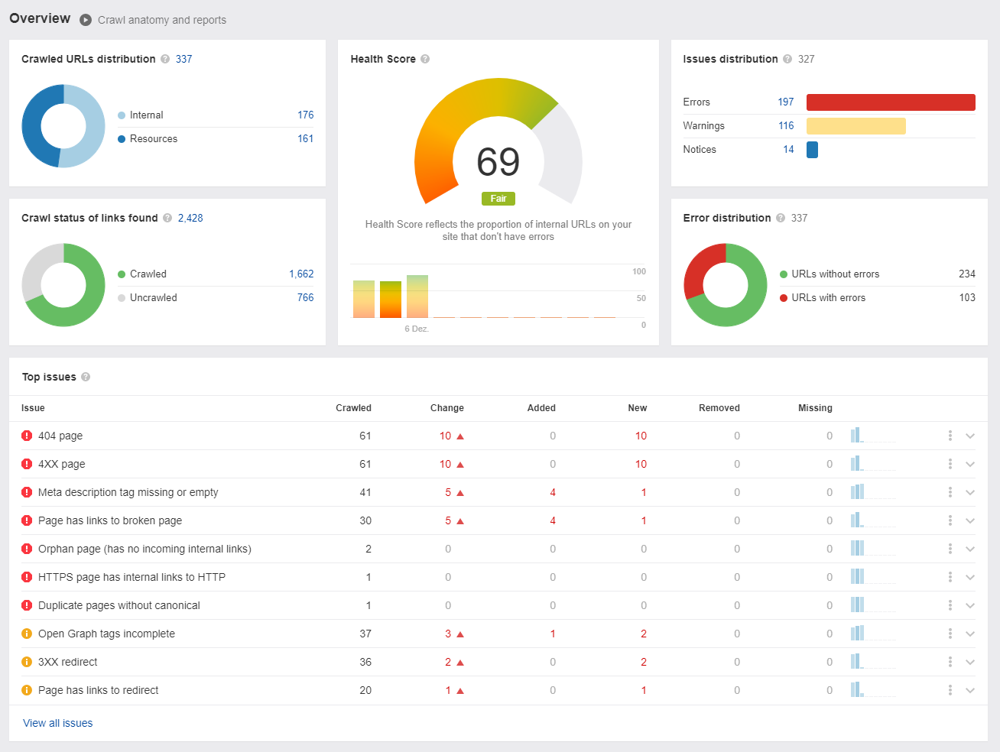 Abbildung 4: https://ahrefs.com/site-audit - Übersicht des SEO-Audits
 

Die vollständige Liste der 404 Fehler kann im Anhang 1 der Bachelorarbeit entnommen werden.

### Crawlability und die Folgen von Fehlern
Suchmaschinen-Crawler verbringen nur eine bestimmte Zeit auf einerWebseite und verfügen über ein bestimmte Crawl-Budget welches bestimmt, wie viele Unterseiten einerWebseite sie crawlen können (vgl. [Ryte, oDd]). Webseiten welche dem Suchmaschinen-Crawler einen 404-Fehlercode zurückgeben, belasten das Crawl-Budget, was dazu führen kann dass neue Inhalte während des Aufenthaltes des Suchmaschinen-Crawlers nicht erfasst werden können.

## Konzeptentwicklung für die Erstellung von qualitativen Inhalten
Um qualitative Inhalte für die gewünschte Zielgruppe erstellen zu können, welche in Einklang mit den Suchintentionen der Zielgruppen sowie den Unternehmenszielen stehen wird im folgenden Abschnitt, wie im Handlungsleitfadens des vorangegangen Praxisprojektes beschrieben PRAPRO!, auf die Mission des Unternehmens, Zieldefinition und Zielgruppendefinition eingegangen.

Die Konzeptentwicklung dient dem Content-Erzeuger dazu sich mit der Mission der Unternehmens, als auch dem Angebotsspektrum des Unternehmens vertraut zu machen. Es gilt dabei in Erfahrung zu bringen, was das Unternehmen anbietet und ob eventuell Alleinstellungsmerkmale im Vergleich zu Mitbewerbern vorliegen. Des Weiteren werden im Zuge der Konzeptenwicklung Fragen zu der Zielgruppe beantwortet, wie zum Beispiel was für Menschen wollen erreicht werden? Um wen handelt es sich bei der Zielgruppe und was für Eigenschaften haben diese? Aber auch die Frage nach den Bedürfnissen und Wünschen, welche die Zielgruppe motivieren nach einer spezifischen Sache zu suchen gehören beantwortet. Ebenfalls gilt es die Frage zu beantworten, ob es eventuell verschiedene Zielgruppen gibt welche seitens des Unternehmens adressiert werden müssen. Was für Unterschiede aber auch Gemeinsamkeiten liegen bei den verschiedenen Zielgruppen vor?

### Mission
Das Unternehmen BSS Schieh-Schneider aus Köln Porz ist Handwerksbetrieb welcher seit 16 Jahren tätig ist in der Beratung, Montage und Reparatur von Fenster & Türen, Rollläden und Markisen für den Raum Köln und Bonn. Sowohl Privat- als auch Gewerbekunden gehören zum Klientel. Das Unternehmen weist diverse fachliche Auszeichnungen und Zertifizierungen auf, und die Angestellten nehmen regelmäßig an Fort- und Weiterbildungen teil. Der Inhaber und Geschäftsführer des Unternehmens, Herr Schieh-Schneider verfügt über eine 40-jährige Erfahrung als Bauschlosser, Facherrichter für Türschließer und Feststellanlagen. Dank dieser Kompetenzen können die individuellen Anforderungen der Kunden effektiv und professionell bewältigt werden.

### Zieldefinition
Der Abschnitt Zieldefinition beschreibt welche konkreten Ziele für die Dienstleistung »Fenster & Türen« erreicht werden sollen. Seitens der Inhabers und Geschäftsführers Herr Schieh-Schneider ist gewünscht, die Sichtbarkeit der Unternehmenswebseiten für die  Dienstleistungen »Fenster & Türen« zu verbessern. Gegenwärtig gewinnt das Unternehmen BSS Schieh-Schneider durch die organische Suche, die meisten Aufträge für den Fenster Reparaturservice im Raum Bonn. Online Anfragen was die Beratung und Montage von Fensterrahmen sowie Fensterbeschlägen, speziell Sicherheitsbeschlägen angeht sind kaum vorhanden, weder für den Raum Bonn noch Köln. Identisch verhält es sich bei den Türen, mit dem Unterschied das es sich in dem Bereich um die Beratung und Montage von Haus- und Sicherheitstüren
handelt.

**SMART-Methode**
Um ein realistisches Ziel zu definieren, welches erreichbar und messbar ist, wird das Ziel der Suchmaschinenoptimierung nach der SMART Methode definiert. Die SMART Methode basiert auf fünf 15 Prinzipien, welche in direktem Zusammenhang mit der Erreichung des Ziels stehen [16](#16).
Der Akronym SMART steht für die folgenden fünf Prinzipien:

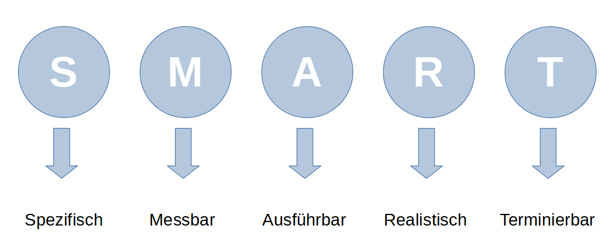 Abbildung 5: Quelle: Eigene Aufnahme - Die SMART-Methode
 

Ein Ziel gilt nur dann als SMART, wenn es allen fünf Prinzipien gerecht wird [17](#17). Das angestrebte Ziel wird dabei unter Einhaltung der Prinzipien, mit jedem Durchgang etwas detaillierter Formuliert.
- Die präzise (spezifische) Formulierung des Ziels verhindert Fehlinterpretationen und gibt vor an welchem Punkt angesetzt werden soll. Beispiel: *Um das Ranking für die Dienstleistungen »Fenster & Türen« zu erhöhen, möchte ich den entsprechenden Content mit qualitative und themenspezifische Inhalten verbessern*.
- Das formulierte Ziel muss messbar sein. Die Kennzahlen oder auch Leistungskennzahlen (englisch: Key Performance Indicators), gestatten es ein mathematisches Verhältnis abzubilden, womit dann eine Aussage zum Erfolg oder Misserfolg getroffen werden kann. Beispiel: Um das
Ranking der Dienstleistungen »Fenster & Türen« um *20 Prozent* zu steigern, möchte ich den entsprechenden Content dank qualitativen und themenspezifischen Inhalten verbessern.
- Das formulierte Ziel muss ausführbar sein, was bedeutet das es zwar ein durchaus ambitioniertes Ziel sein darf, aber es sollte erreichbar sein hinsichtlich seiner Umsetzung. Beispiel: Um das Ranking der Dienstleistungen »Fenster & Türen« um 20 Prozent zu steigern, möchte ich den entsprechenden Content dank qualitativen und themenspezifischen Schlüsselwörtern verbessern. *Dafür ergänze ich bereits vorhandene Inhalte und strukturiere die entsprechenden Bereiche um*.
- Das formulierte Ziel sollte sich in einem Bereich des machbaren (realistischen) befinden und keine utopischen Erwartungen inne haben.
- Letztendlich sollte das Ziel eine bestimmte Frist erhalten. Eine klare Zeitvorgabe hilft bei der Umsetzung und dient den Beteiligten als Kontrollinstrument. Beispiel: Um das Ranking der Dienstleistungen »Fenster & Türen« bis *Januar 2021* um 20 Prozent zu steigern, möchte ich den entsprechenden Content dank qualitativen und themenspezifischen Schlüsselwörtern verbessern. Dafür ergänze ich bereits vorhandene Inhalte und strukturiere die entsprechenden Bereiche um.

Das definierte SMART-Ziel für den Fachbetrieb BSS Schieh-Schneider lautet: *Um das Ranking der Dienstleistungen »Fenster & Türen« bis Mitte Januar 2021 um 20 Prozent zu steigern, möchte ich den entsprechenden Content dank qualitativen und themenspezifischen Schlüsselwörtern verbessern. Dafür ergänze ich bereits vorhandene Inhalte und strukturiere die entsprechenden Bereiche um*.

## Zielgruppendefiniton
Nachdem die Mission des Unternehmens sowie das Ziel definiert wurden, muss herausgefunden werden wer die Personen sind die erreicht werden sollen. Inhalte welche die falsche Zielgruppe adressieren, verfehlen ihr Ziel und erreichen nicht die gewünschte Leserschaft.
Wichtige Informationen für die Identifizierung der Zielgruppe sind soziodemografische Merkmale wie zum Beispiel das Alter, Geschlecht, Kaufkraft, Siedlungsart. Des Weiteren spielen psychologische Merkmale ebenfalls eine Rolle, hierbei gilt es in Erfahrung zu bringen was die Bedürfnisse und Motive der Personen sind [18](#18). Decken sich die Bedürfnisse und Motive der Personen die erreicht werden sollen mit den Zielen des Unternehmens, wurde die richtige Zielgruppe definiert.

Im Mittelpunkt des Unternehmens BSS Schieh-Schneider steht die Beratung, Montage und Reparatur von Fenstern & Türen, Rollladen und Markisen. Privatpersonen als auch gewerbliche Kunden machen Gebrauch von den Dienstleistungen des Handwerksbetriebs. Die Erstgespräche sowie die Beratung fanden immer mit dem Inhaber des Unternehmens statt. Basierend auf diesem Informationsfundus wurde zusammen mit dem Inhaber die Zielgruppendefiniton für das Unternehmen erstellt. Als Resultat konnten zwei unterschiedliche Typen von Nutzern identifiziert werden:

- Erwachsene, rational denkende Person mit Interesse an moderner und ästhetischer Tür- & Fenstertechnologie, welche im Raum Köln oder Bonn arbeitet. Die Zielgruppe besteht aus Entscheidungsträgern, welche Zugang zu einem guten Budget haben und keinen Fehlkauf machen möchten. Die Person hat eine Erwartungshaltung hinsichtlich der ästhetischen Aspekte, allerdings kaum oder nur wenig Wissen hinsichtlich sicherheitstechnischer Aspekte. Das Alter der Zielgruppe liegt zwischen dreißig und fünfzig Jahren.

- Erwachsene Person, hat ihr Eigenheim abgezahlt und möchte dieses mit einbruchhemmender Technik ausstatten oder ein beschädigtes Fenster- oder Türenelement reparieren lassen. Gründe für das nachrüsten sind meistens erhöhte Einbrüche in der Nachbarschaft oder ein misslungener Einbruch. Die Person hat einen gewissen ästhetischen  Anspruch, legt ihren Fokus allerdings  mehr auf funktionale Aspekte. Die Person hat sich im Vorfeld bereits über gewisse Standards informiert und erwartet eine individuelle und günstige Lösung, welche den aktuellen  Sicherheitstandards entspricht. Das Alter der Zielgruppe liegt zwischen vierzig und sechzig Jahren und die Person liebt im Raum Köln oder Bonn.

### Personas
Personas beschreiben fiktive Personen welche einen Teil der Zielgruppe mit ihren Eigenschaften,
Bedürfnissen und Motiven entsprechen. Mit Hilfe der Personas wird versucht ein Muster im Nutzerverhalten
deutlicher zu machen. Da für das vorliegende Projekt keine empirische Erhebung basierend
auf Nutzer- und kontetxuellen Interviews stattgefunden hat, werden Proto-Personas verwendet.
Proto-Pesonas beschreiben reduzierten Personas basierend auf vorhanden Wissen und der Basis von
Vermutungen über die zu erreichende Zielgruppe. Der Fokus liegt bei den Proto-Personas auf den
Motivationen und Bedürfnissen der Benutzer. Die erzeugten Personas finden bei der Ideenfindung für
Schlüsselwörter Verwendung, indem versucht wird aus der Perspektive der Persona Suchbegriffe zu
erstellen, um bestimmte Bereiche der Webseiten aufrufen zu können.

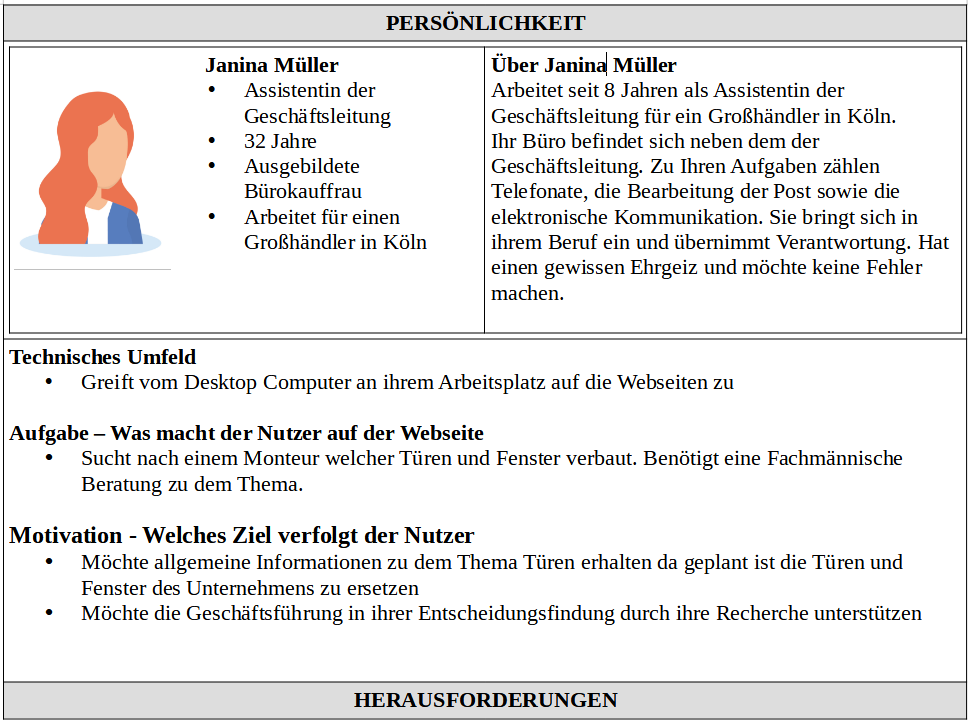 Abbildung 6: Profilbild Avatar von www.freepik.com - Proto-Persona Janina Müller
 

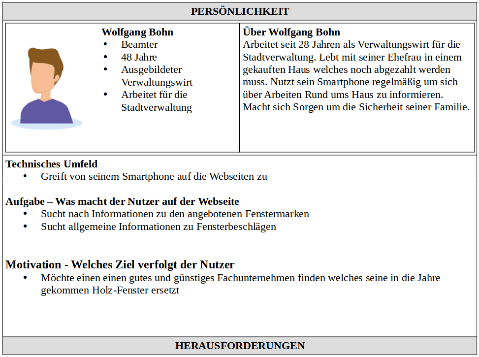 Abbildung 7: Profilbild Avatar von www.freepik.com - Proto-Persona Wolfgang Bohn
 

## Pillar-Content
Sämtliche Inhalte zu den Themen »Fenster & Türen« wurden vor der Suchmaschinenoptimierung, auf den Unternehmens Webseiten auf jeweils einer einzelnen Landingpage abgebildet.

`https://www.bss-schieh-schneider.de/leistungen/fenster/`

`https://www.bss-schieh-schneider.de/leistungen/tueren/`

Basierend auf der Zieldefinition sowie der Zielgruppenanalyse wurde entschieden, die vorhandenen Inhalte zu den Leistungen »Fenster & Türen« nach der »Pillar Content« Strategie umzustrukturieren. Beim Pillar Content handelt es sich um eine Strategie, welche Inhalte mit einer hohen thematischen Relevanz, in zentrale Inhalte und Nebeninhalte strukturiert [19](#19). Das »Pillar Topic « behandelt dabei das Kernthema, wohingegen die »Subtopics« oder auch »Content Cluster«, sich mit den Ausprägungen des Kernthemas beschäftigen. Durch die Trennung in Subtopics wird eine Seitenarchitektur umgesetzt, welche darauf ausgerichtet ist, die URLs derWebseiten anzuordnen und durch Links zu verknüpfen, das mehrere Seiten der Webseite es in die Suchergebnisseiten der Suchmaschine schaffen [20](#20).

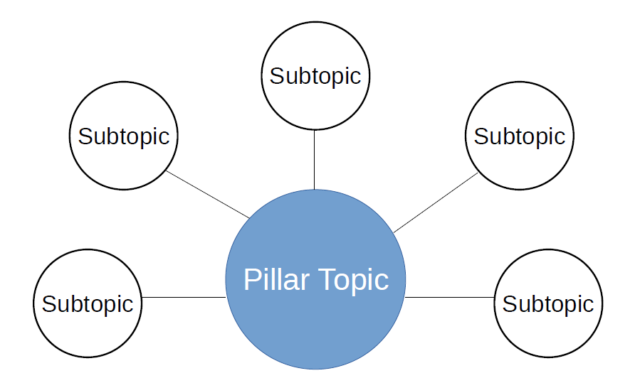 Abbildung 8: Quelle: Eigene Aufnahme - Pillar Content
 

Die Pillar-Content Strategie verfolgt dabei das Ziel, im Kernthema die Schlüsselwörter zu verwenden, welche sich ausschließlich mit den zentralen Inhalt beschäftigen. Die Subtopics hingegen beherbergen die Inhalte mit den Longtail-Schlüsselwörter. Mit der Pillar-Methode kann ein spezifisches Themengebiet auf denWebseiten umfassend abgedeckt werden, was wiederum die SEO Autorität für das jeweilige Thema ausbaut. Die SEO Autorität einerWebseite beschreibt die Relevanz und Gewichtung der Webseite in Bezug auf ein spezifische Suchthema [21](#21). Am Beispiel der Unternehmenswebseiten wäre das Ziel die SEO Autorität für die Themen Fenster und Türen ausbauen.

Suchphrasen mit mehr als 5 Wörtern machen gegenwärtig 41.7% aller Suchen aus. Suchphrasen bestehend aus 4 bzw. 3 Wörtern haben einen Anteil von jeweils 22.8% bzw. 21.9% [22](#22). Mit Hilfe der Pillar-Content Strategie kann der Conntent-Erzeuger detaillierte Anfragen der Suchenden besser beantwortet, indem dieser in den Subtopics detaillierter auf die jeweilige Thema eingeht.

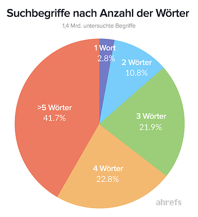 Abbildung 9: https://blog.hubspot.de/marketing/inhalte-an-online-suche-anpassen - Suchbegriffe nach Anzahl der Wörter
 

Weitere Vorteile die Inhalte thematisch zu clustern, ist die damit einhergehende Strukturierung der Inhalte, sowie die Erzeugung von internen Links.

Individuelle Blog-Beiträge können für bestimmte Suchphrasen ein hohes Ranking erreichen, allerdings besteht die Möglichkeit das durch zu viele Blog-Beiträge, auf Dauer die Benutzerfreundlichkeit der Webseiten leidet. Weiterführende Inhalte zum ursprünglichen Blog Post können durch eine schlechte Strukturierung nicht sofort gefunden werden [20](#20) und der angekommene Nutzer sieht sich gezwungen eine weitere Suchanfrage in der Suchmaschine anzustoßen.

Eine HubSpot Studie wies des Weiteren nach, dass Themen welche nach der Pillar-Content Methode erzeugt wurden und dadurch mehr interne Verlinkungen vorzuweisen hatten, sich sowohl in den Suchergebnisseiten besser positionieren konnten, als das diese auch mehr Impressionen vorzuweisen hatten [23](#23).

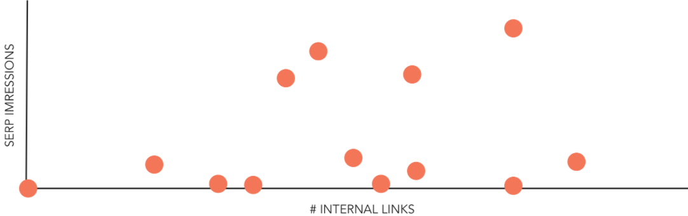 Abbildung 10: https://www.anumhussain.com/presentations/topics-over-keywords - Topics over Keywords
 

Für die Unternehmenswebseiten BSS Schieh-Schneider lassen sich die folgenden Kernthemen und
Subtopics ableiten:

**Fenster**
- Fensterrahmen
- Fensterbeschläge
- Fenster Reparatur

**Türen**
- Haustüren
- Sichereitstüren
- Türen Reparatur

## Nutzererlebnis Optimierung
Analog zur vierten Ebene der SEO Bedürfnispyramide wird in diesem letzten Abschnitt der SEOStrategie betrachtet, wie die Nutzererlebnis Optimierung verbessert werden kann. Die gegenwärtigen Webseiten des Unternehmens BSS Schieh-Schneider sind »Responsive« und gewährleisten so, dass die Inhalte flexibel auf dem Desktop-Computer, Tablet und Smartphone eine einheitliche Benutzerfreundlichkeit bieten.

### Verbesserung der Ladezeiten
Die Ladezeit einer Webseite gilt mitunter als ein wichtiger Faktor für den Erfolg einer Webseite, den ab dem 1. Juli 2019 nutzt die Suchmaschine Google die mobilen Inhalte für die Indexierung und das Ranking [24](#24). Laut einer Google Studie aus dem Jahr 2017, beträgt die Absprungsrate der mobilen Nutzer 53% wenn eine Webseite mehr als 3 Sekunden benötigt die aufgerufenen Inhalte zu laden [25](#25). Für Webseiten mit einer längeren Ladezeit als 10 Sekunden, erhöht sich die Absprungrate um 123%.

Die Ladezeiten der Unternehmens Webseiten wurden daher mit dem Online-Dienst »PageSpeed Insights « untersucht. Der Online-Dienst von Google betrachtet Faktoren wie den Aufbaue der Skriptsprachen HTML und Javascript, als auch die Formatierungssprache CSS sowie die Integration von Bildern. Im Rahmen des Tests werden die Ergebnisse mitunter mit den Daten aus Googles Bericht zur Nutzererfahrung in Chrome verglichen [26](#26). Der Content-Erzeuger erhält nach Abschluss des Tests einen »Performance Wert« auf einer Skala von 0 bis 100. Die Auswertung erfolgt sowohl für die Mobile- als auch die Desktop-Ansicht der Webseiten. Zusätzlich zum Performance Wert stellt das Tool Optimierungspotentiale zusammen, welche laut Google die Ladezeiten der Webseiten möglicherweise reduzieren könnten.

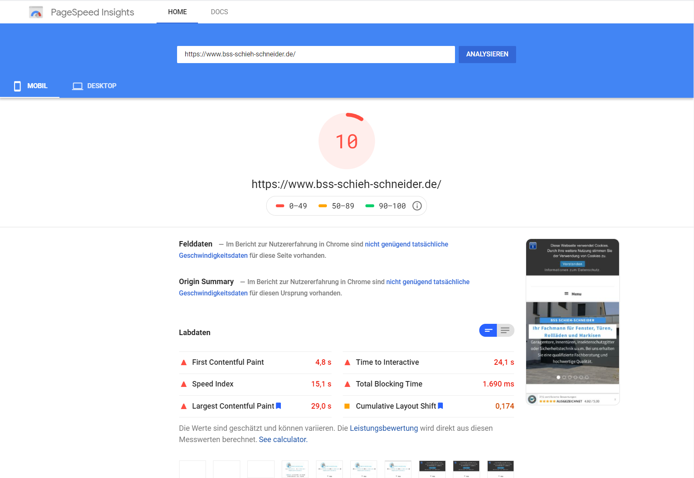 Abbildung 11: https://developers.google.com/speed - Ergebnis der Auswertung für die Mobile-Ansicht
 

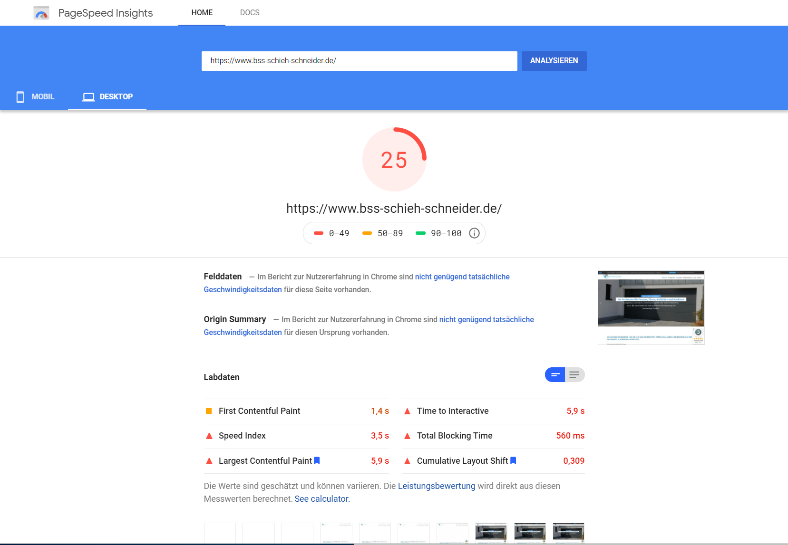 Abbildung 12: https://developers.google.com/speed - Ergebnis der Auswertung für die Desktop-Ansicht
 

Sowohl für die Desktop-Variante als auch die Mobile-Variante liegt Handlungsbedarf vor. Der Performance Wert für die Mobile-Variante beträgt 10 von 100 Punkten und für die Desktop-Variante 25 von 100 Punkten. Die Ladezeit hingegen beträgt 15,3 Sekunden. Der von Google Mitarbeitern empfohlene Performance Wert für die Mobile-Variante einer Webseite beträgt 85 von 100 Punkten [27](#27). Die Ladezeiten sollten sich zwischen zwei und drei Sekunden befinden um als »schnell« bewertet zu werden.

Das Tool PageSpeed Insights empfiehlt folgende Änderungen zu vollziehen um den PerformanceWert erhöhen zu können:

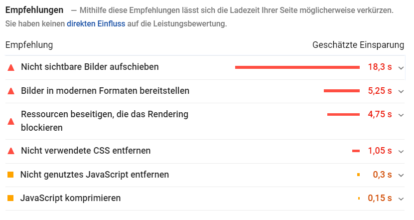 Abbildung 13: https://developers.google.com/speed - Übersicht der Empfehlungen
 

Die Empfehlungen wurden in die Liste der zu erledigen SEO-Maßnahmen aufgenommen.

### Fehler bei der Nutzerfreundlichkeit auf Mobilgeräten
Weitere Fehler in der Usability, speziell der Mobile Usability, konnten in der Google Search Console im »Bericht zur Nutzererfahrung auf Mobilgeräten« ermittelt werden.

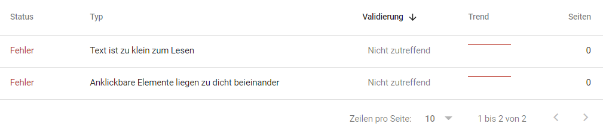 Abbildung 14: https://search.google.com/search-console - Bericht zur Nutzererfahrung auf Mobilgeräten
 

Dabei wurde festgestellt das zwei Probleme vorliegen, welche auf eine zu kleine Schriftgröße der Navigation zurückzuführen sind.

- Text ist zu klein zum Lesen
- Anklickbare Elemente liegen zu dicht beieinander

Die Empfehlung seitens Google die Schriftgröße für das entsprechende Element zu erhöhen [28](#28), wurde ebenfalls in die Liste der zu erledigen SEO-Maßnahmen aufgenommen.

### Optimierung der Navigation
Damit der Nutzer in der Lage ist seine Ziele auf den Webseiten zu erreichen, sollte die Navigation so einfach und intuitiv wie nur möglich gestaltet sein. Bei der Navigation der Unternehmenswebseiten BSS Schieh-Schneider ist aufgefallen, dass die Untermenüs der Navigation nicht mit Indikatoren versehen wurden. Der Nutzer müsste um zu erfahren das hinter einem bestimmten Menüpunkt weitere Inhalte verborgen sind, erst mit dem Mauszeiger über den Punkt scrollen.

Aus Sicht der Usability ist es das Ziel des Content-Erzeugers dafür zu sorgen, das der Webseiten Nutzer mit Hilfe der Navigation seine Ziele auf denWebseiten immer erreichen kann [29](#29). Die fehlenden Indikatoren wurden in die Liste der zu optimierenden OnPage Maßnahmen aufgenommen.

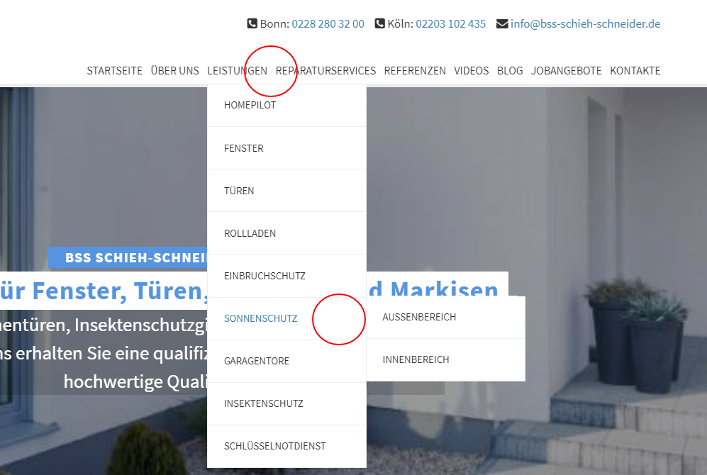 Abbildung 15: Eigene Aufnahme: Fehlende Navigation Indikatoren
 

---

<a name="1">1<a> Schelter, M. (2019): Seo-strategie: So Optimierst Du Deine Seite <https://www.seokratie.de/seo-strategie/>

<a name="2">2<a> McCoy, J. (2018): Why Content is important for SEO. <https://www.searchenginejournal.com/seo-101/content-important-seo/>

<a name="3">3<a> Flandorfer, P. (2019): Die Bedürfnispyramide von Maslow verstehen und anwenden. <https://www.scribbr.de/modelle-konzepte/beduerfnispyramide-maslow/>

<a name="4">4<a> Windolph, A. (2017): Bedürfnispyramide nach maslow: Was Du als Projektleiter Wissen
musst. <https://projekte-leicht-gemacht.de/blog/pm-methoden-erklaert/beduerfnispyramide-maslowprojektmanagement/>

<a name="5">5<a> Moz.com. (o.D.): The beginner’s Guide to SEO. <https://moz.com/beginners-guide-to-seo>

<a name="6">6<a> Terentva, E. (2020): What are Crawlability and Indexability: How Do They Affect SEO? <https://www.semrush.com/blog/what-are-crawlability-and-indexability-of-a-website/>

<a name="7">7<a> Sistrix (2020): Wie erstelle ich einen guten SEO-Text? Minimum 200 – 300 Wörter oder mehr? <https://www.sistrix.de/frag-sistrix/onpage-optimierung/wie-erstelle-ich-einen-guten-seo-text-minimum-200-300-woerter-oder-mehr/>

<a name="8">8<a> Ahref.com (o.D.): Was ist die Keyword Difficulty bzw. Keyword-Schwierigkeit? <https://ahrefs.com/de/keyword-difficulty>

<a name="9">9<a> An, D. (2017): Find Out How You Stack Up to New Industry Benchmarks for Mobile Page Speed <https://www.thinkwithgoogle.com/intl/en-ca/marketing-strategies/app-and-mobile/mobile-page-speed-new-industry-benchmarks/>

<a name="10">10<a> Georgiou, M. (2015): 7 Things Content Creators Do to Create Share Worthy Content <https://www.searchenginejournal.com/7-things-content-creators-create-share-worthy-content/130865/>

<a name="11">11<a> ShareThis.com (o.D.): SEO und Social Media: 50 Expertenzitate darüber, wie sich Social Media auf SEO auswirkt (und umgekehrt). <https://sharethis.com/de/best-practices/2018/04/seo-and-social-media/>

<a name="12">12<a> Google (o.D.): Create good titles and snippets in search results <https://developers.google.com/search/docs/advanced/appearance/good-titles-snippets>

<a name="13">13<a> Dean, B. (2019): Here's What We Learned About Organic Click Through Rate <https://backlinko.com/google-ctr-stats>

<a name="14">14<a> Google (2020): So funktionieren strukturierte Daten <https://developers.google.com/search/docs/guides/intro-structured-data?hl=de>

<a name="15">15<a> Google (2012): Crawl errors: The next generation. <https://developers.google.com/search/blog/2012/03/crawl-errors-next-generation>

<a name="16">16<a> sevDesk (2020): Ziele richtig formulieren <https://sevdesk.de/blog/smart-methode>

<a name="17">17<a> Klober, Y. (o.D.): Die SMART-Methode: So setzen Sie SMART-Ziele <https://blog.hubspot.de/marketing/smart-ziele>

<a name="18">18<a> Ernie, C. (2020): Warum die Zielgruppen am Anfang Ihres Webprojekts stehen <https://blog.internezzo.ch/zielgruppen-wer-sind-meine-kaeufer>

<a name="19">19<a> Textbroker (o.D.): Pillar Content <https://www.textbroker.de/pillar-content>

<a name="20">20<a> Bernazzani, S. (o.D.): Was ist eine Pillar-Seite und welche Relevanz hat sie für Ihre SEO? <https://blog.hubspot.de/marketing/was-ist-eine-pillar-seite>

<a name="21">21<a> Indexlift (o.D.): SEO Authority <https://www.indexlift.com/de/glossar/authority>

<a name="22">22<a> Lapp, J. (2020): Die Online-Suche hat sich verändert – Ihre Inhalte müssen das auch <https://blog.hubspot.de/marketing/was-ist-eine-pillar-seite>

<a name="23">23<a> Anum, H. (2015): Topics over keywords: An seo-driven approach to content marketing. <https://www.anumhussain.com/presentations/topics-over-keywords>

<a name="24">24<a> Google (2020): Best practices für die mobile First-Indexierung. <https://developers.google.com/search/mobile-sites/mobile-first-indexing?hl=de>

<a name="25">25<a> An, D. (2017): Find Out How You Stack Up to New Industry Benchmarks for Mobile Page Speed <https://www.thinkwithgoogle.com/intl/en-ca/marketing-strategies/app-and-mobile/mobile-page-speed-new-industry-benchmarks/>

<a name="26">26<a> Google (2020): Was sind die Google Pagespeed Insights? <https://www.sistrix.de/frag-sistrix/page-speed-insight/>

<a name="27">27<a> Kopp, O (2020): Page Speed: Wie wichtig sind Ladezeiten als Rankingfaktor für SEO bei Google? <https://www.sem-deutschland.de/blog/page-speed-seo-ranking/>

<a name="28">28<a> Google (o.D.): Bericht zur Nutzererfahrung auf Mobilgeräten <https://support.google.com/webmasters/answer/9063469?hl=de>

<a name="29">29<a> Broschart, S. (2010): Suchmaschinenoptimierung & Usability, Seite 308-309
