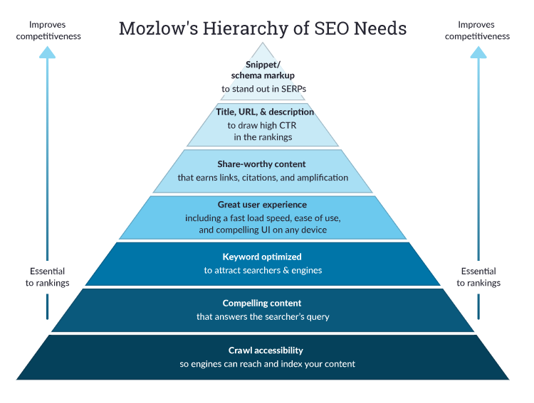

# SEO-Strategie
Um der Zielsetzung der Bachelorarbeit gerecht zu werden zu werden, hat das folgende Kapitel das Vorhaben inne, eine
SEO-Strategie auszuarbeiten, welche individuell auf das Projekt abgestimmt ist. Ausgangspunkt und
Fokus der Strategie ist der Nutzer, deren Webseiten und dessen Bedürfnisse. Der Content-Erzeuger
setzt sich dabei mit den Bedürfnissen des Nutzers auseinander und versucht diese mit der Unternehmens
Mission abzustimmen [1](#1).

Es gilt dabei nicht nur die Frage zu beantworten was die Bedürfnisse des Nutzers sind, sondern wie
diese auf den Webseiten technisch umgesetzt werden können, um den Aufenthalt des Nutzers unterstützend
zu begleiten. Qualitative Inhalte spielen eine wichtige Rolle [2](#2), jedoch
fließen in die Bewertung einer Webseite seitens der Suchmaschine noch weitere Faktoren mit ein. Aus
Sicht des Content-Erzeugers, gilt es daher die Faktoren für die gegenwärtig betrachtenden Webseiten
festzustellen und darauf basierend, die entsprechenden Suchmaschinen optimierenden Maßnahmen
herzuleiten.

## Die Maslowsche Hierarchie der SEO-Bedürfnisse

 Abbildung 1: https://moz.com/beginners-guide-to-seo - SEO Bedürfnispyramide nach Maslow
 

Die obige Abbildung (Abbildung 1) ist eine Anlehnung an die »Maslowsche Bedürfnispyramide«.
Bei dieser handelt es sich um ein sozialpsychologisches Modell, welches auf eine vereinfachende Art
und Weise die menschlichen Bedürfnisse und Motivationen, in Form einer hierarchischen Struktur
beschreibt [3](#3) [4](#4). Die Theorie besagt, das die Wachstumsbedürfnisse
nur zu erreichen sind, wenn nicht sichergestellt wird, dass die grundlegenden Bedürfnisse
zu erst erfüllt werden.

Basierend auf der Maslowsche Bedürfnispyramide wurde das Konzept der »Maslowschen Hierarchie
der SEO-Bedürfnisse« erstellt [5](#5). Die ersten drei Ebenen stellen die grundlegenden
Bedürfnisse dar und bilden dabei aus SEO-Sicht die Maßnahmen ab, welche der Content-Erzeuger
besonders aufmerksam betrachten sollte. Den dass Erfüllen der grundlegenden Bedürfnisse hat Einfluss
darauf, ob die bereitgestellten Inhalte von den Nutzern überhaupt gefunden werden können.
Die weiteren vier Ebenen der Bedürfnispyramide, welche zu den Wachstumsbedürfnisse zuzuordnen
sind und repräsentieren Maßnahmen, welche dazu beitragen können die eigenen Inhalte sowohl für
die Nutzer, als auch die Suchmaschine hervorstehen zu lassen.

- Crawl accessibility: Analog zu den »Physischen Grundbedürfnissen« der Maslowsche Bedürfnispyramide bildet das Fundament der SEO-Maßnahmen die Crawlability. Die Crawlability beschreibt wie die Fähigkeit der Suchmaschine, auf die Inhalte einer Webseite zugreifen können. Eine Webseite ohne Fehler kann vom Suchmaschinen-Crawler vollständig erfasst werden, indem dieser den internen links innerhalb der Webseiten folgt [6](#6). Bevor Inhalte in den Index einer Suchmaschine aufgenommen werden müssen diese zuvor vom Suchmaschinen-Crawler erfasst werden. Crawlability-Probleme könnte zum Beispiel sein, dass eine fehlerhafte Robots.txt erzeugt wurde, welche bestimmte Bereiche der Domain vor dem Crawler der Suchmaschine verbirgt. Das unbeabsichtigte setzen eines »Nofollow-Link« hat ebenfalls zur Folge, dass der Crawler die Seite hinter dem Link komplett ignoriert. Genauso verhält es sich mit einem defekten Link welcher auf eine URL verweist welche nicht existiert. Die publizierten Inhalte auf den unbeabsichtigt ignorierten Seiten oder hinter den defekten Links, würden dadurch nicht in den Suchergebnissen erscheinen.

- Compelling content: Qualitative Inhalte welche die Bedürfnisse der Suchenden stillen können, bilden nach der Crawlability die zweite Ebene der SEO Bedürfnispyramide ab. Die Inhalte sollten einzigartig sein, auf einer überschaubaren Strukturierung aufsetzen und dem Suchenden einen gewissen Mehrwert anbieten. Idealerweise werden die Inhalte von keinem Mitbewerber so ansprechend aufbereitet wie die auf den eigenenWebseiten. Die Produkte und Dienstleistungen sind präzise beschrieben. Fragestellungen welche Suchende häufig stellen, werden in den Inhalte beantwortet [7](#7).

- Keyword optimized: Auf der dritten Ebene befindet sich die Keyword-Optimierung. In Abhängigkeit der verwendeten Schlüsselwörter, kann mit den publizierten Inhalte einem größeres Publikum erreicht werden. Entscheidende Faktoren bei der Wahl des Schlüsselwortes (eng. Keyword) sind, dass Suchvolumen als auch der Keyword-Schwierigkeitsgrad). Die Kombination aus Schlüsselwörtern mit hohem Suchvolumen, gepaart mit einem niedrigen Keyword- Schwierigkeitsgrad, kann mehr Traffic für die Webseiten generieren [8](#8).

- Great user experience: Die vierte Ebene betrachtet die Nutzererlebniserfahrung (User-Experience) einer Webseite. Ein ansprechendes Design der Webseite und eine überschaubare Navigation sind nur einige Einflüsse, welche von Nutzern als positive Nutzererlebniserfahrung interpretiert werden. Für Suchende welche von mobilen Geräten wie einem Smartphone Webseiten aufrufen, spielt die Ladezeit die benötigt wird eine wichtige Rolle. Das Ergebnis einer Google Studie in welcher über 900.000 Landingpage untersucht wurden, hat mitunter ergeben das der Anstieg der Ladzeit von einer auf zehn Sekunden, statistisch gesehen zu einer Absprungrate von 123% führt [9](#9).

- Share-worthy content: »Share-worthy content« beschreibt Inhalte welche sich von Blog-Beiträgen und qualitativen Inhalten in der Form unterscheiden, dass der Nutzer diese in seinen Sozialen 10 Netzwerken teilen möchte [10](#10). Dabei könnte es sich zum Beispiel um Inhalte handeln, welche aktuelle Fragen beantworten oder kontroverse Themen aufgreifen, mit denen sich andere Content-Erzeuger bisher noch nicht beschäftigt haben. Geteilte Inhalte tragen dazu bei, das die Anzahl der eingehenden Links auf die eigenen Webseiten erhöht wird. Dieser Faktor kann wiederum positiv in die Suchmaschinenbewertung mit einfließen  [11](#11).

- Title, URL & description: Die fünfte und vorletzte Ebene beschäftigt sich mit Meta-Titelnund Beschreibungen sowie »sprechenden« URLs. Meta-Titel (Seitentitel) geben kurz und prägnant den Inhalt der Seite wieder. Die Meta-Beschreibung hingegen stellt eine kurze Zusammenfassung der Inhalt dar. Der Meta-Titel als auch die Meta-Beschreibungen sind Ranking relevante Faktoren und finden Verwendung in den Suchergebnisseiten [12](#12). Sprechende URLs vermitteln dem Suchenden auch nochmal zusätzlich, worum es sich Inhaltlich auf der entsprechenden Seite handeln wird. Sowohl Meta-Titel, die Meta-Beschreibung als auch die URLs sollten mit Schlüsselwörtern versehen werden. URLs welche mit einem Schlüsselwort versehen wurden, haben statistisch gesehen eine um 45% erhöhte Klickrate im Vergleich zu URLs welche keine Schlüsselwörter verwenden [13](#13).

- Snippet/Schema markup: Die letzte Ebene der »Maslowschen Hierarchie der SEO-Bedürfnisse« geht auf das Thema Strukturierte Daten ein. Mit Hilfe von »Markups« können im Quellcode der eigenen Webseite Informationen zu den Inhalten strukturiert werden. Suchmaschinen profitieren von den aufbereiteten Markups da diese ihnen ermöglichen, die bereitgestellten Inhalte mit weniger Aufwand zu erkennen, bearbeiten und intern zu organisieren [14](#14). Je detaillierter die Angaben desto größer die Wahrscheinlichkeit, dass die Suchmaschine die Inhalte auch der Zielgruppe anzeigt, welche der Content-Erzeuger zu erreichen versucht.

Damit das Ziel die Sichtbarkeit der Unternehmenswebseiten für das Thema »Fenster & Türen« zu
verbessern erreicht werden kann, wird die folgende SEO-Strategie sich danach ausrichten, die Anforderungen
der einzelnen Ebenen der »SEO-Bedürfnispyramide« zu erfüllen.

## Crawlability prüfen

Die Prüfung ob eineWebseite durch den Suchmaschinen Crawler in den Index aufgenommen werden
konnte, lässt sich für Google mit folgenden Suchoperator nachvollziehen:

site:bss-schieh-schneider.de

BILD!

Das Ergebnis der erweiterten Suche gibt zurück, dass die Suchmaschine Google für die Domain
www.bss-schieh-schneider.de ungefähr 87 Seiten in ihrem Index hat. Bei dem Wert handelt es sich
lediglich um eine Annäherung des tatsächlichen Ergebnisses. Möchte zum Beispiel gezielt geprüft
werden ob der Bereich »Leistungen« sich im Index der Suchmaschine Google befinden, wird der
Suchoperator um den entsprechenden Verzeichnis Namen erweitert.

site:bss-schieh-schneider.de/leistungen

BILD!

---

<a name="1">1<a> Schelter, M. (2019): Seo-strategie: So Optimierst Du Deine Seite <https://www.seokratie.de/seo-strategie/>

<a name="2">2<a> McCoy, J. (2018): Why Content is important for SEO. <https://www.searchenginejournal.com/seo-101/content-important-seo/>

<a name="3">3<a> Flandorfer, P. (2019): Die Bedürfnispyramide von Maslow verstehen und anwenden. <https://www.scribbr.de/modelle-konzepte/beduerfnispyramide-maslow/>

<a name="4">4<a> Windolph, A. (2017): Bedürfnispyramide nach maslow: Was Du als Projektleiter Wissen
musst. <https://projekte-leicht-gemacht.de/blog/pm-methoden-erklaert/beduerfnispyramide-maslowprojektmanagement/>

<a name="5">5<a> Moz.com. (o.D.): The beginner’s Guide to SEO. <https://moz.com/beginners-guide-to-seo>

<a name="6">6<a> Terentva, E. (2020): What are Crawlability and Indexability: How Do They Affect SEO? <https://www.semrush.com/blog/what-are-crawlability-and-indexability-of-a-website/>

<a name="7">7<a> Sistrix (2020): Wie erstelle ich einen guten SEO-Text? Minimum 200 – 300 Wörter oder mehr? <https://www.sistrix.de/frag-sistrix/onpage-optimierung/wie-erstelle-ich-einen-guten-seo-text-minimum-200-300-woerter-oder-mehr/>

<a name="8">8<a> Ahref.com (o.D.): Was ist die Keyword Difficulty bzw. Keyword-Schwierigkeit? <https://ahrefs.com/de/keyword-difficulty>

<a name="9">9<a> An, D. (2017): Find Out How You Stack Up to New Industry Benchmarks for Mobile Page Speed <https://www.thinkwithgoogle.com/intl/en-ca/marketing-strategies/app-and-mobile/mobile-page-speed-new-industry-benchmarks/>

<a name="10">10<a> Georgiou, M. (2015): 7 Things Content Creators Do to Create Share Worthy Content <https://www.searchenginejournal.com/7-things-content-creators-create-share-worthy-content/130865/>

<a name="11">11<a> ShareThis.com (o.D.): SEO und Social Media: 50 Expertenzitate darüber, wie sich Social Media auf SEO auswirkt (und umgekehrt). <https://sharethis.com/de/best-practices/2018/04/seo-and-social-media/>

<a name="12">12<a> Google (o.D.): Create good titles and snippets in search results <https://developers.google.com/search/docs/advanced/appearance/good-titles-snippets>

<a name="13">13<a> Dean, B. (2019): Here's What We Learned About Organic Click Through Rate <https://backlinko.com/google-ctr-stats>

<a name="14">14<a> Google (2020): So funktionieren strukturierte Daten <https://developers.google.com/search/docs/guides/intro-structured-data?hl=de>

